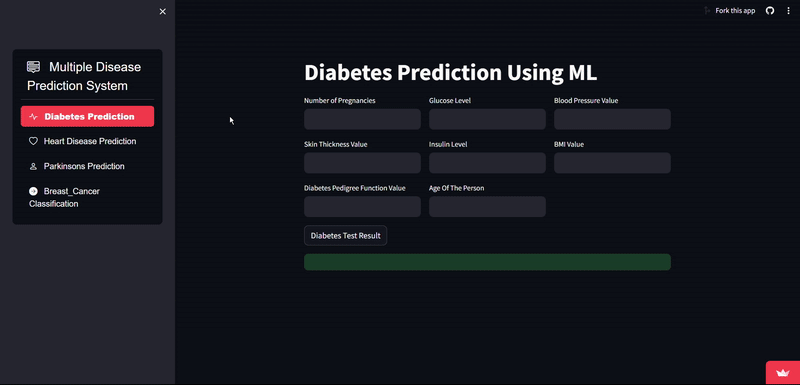

# Multiple Disease Prediction

> *You can view the working project [here](https://multiplediseaseprediction-tvhhw8v4dnekxmujhq3aqr.streamlit.app/).*

Multiple Disease Prediction System utilizes machine learning techniques to predict health conditions including diabetes, heart disease, Parkinson's disease, and breast cancer.
Implemented machine learning models such as Support Vector Machines (SVM) for diabetes prediction, Logistic Regression for heart disease prediction, and tailored models for Parkinson's disease and breast cancer, achieving high accuracy rates.
Designed and implemented an interactive and user-friendly Streamlit-based interface enabling users to input health data effortlessly and obtain instant predictions, enhancing accessibility and usability.

*Disclaimer: No data is stored in the server. It is for testing purpose only.*

## Getting Started

*1.* Fork [this](https://github.com/PranjalTyagi16/Multiple_Disease_Prediction) repository.
Click on the  symbol at the top right corner.

*2.* Clone the forked repository.

bash
git clone https://github.com/<your-github-username>/Multiple_Disease_Prediction

*3.* Navigate to the project directory.

bash
cd Multiple_Disease_Prediction

*4.* Create a new branch.

bash
git checkout -b <your_branch_name>

*5.* Make changes in source code.

*6.* Stage your changes and commit

bash
#Add changes to Index
git add .

#Commit to the local repo
git commit -m "<your_commit_message>"

>CAUTION: Synch up your local repo with [original repo](https://github.com/PranjalTyagi16/Multiple_Disease_Prediction) (Upstream) before pushing your commits.
>This avoids unnecessary conflicts during the merge.

*7.* Push your local commits to the remote repo.

bash
git push -u origin <your_branch_name>

*8.* Create a [PR](https://help.github.com/en/github/collaborating-with-issues-and-pull-requests/creating-a-pull-request) !

*9.* Make your contribution to WhatsApp Chat Analyzer.

*NOTE*: **Feel free to [open issues](https://github.com/PranjalTyagi16/Multiple_Disease_Prediction/issues/new/choose)**.

## Run on Local System

- Install packages given in requirements.txt (packages need *Python 3.11.0*).

bash
pip install -r requirements.txt

- Run the below command to start your local server.

bash
streamlit run app.py

---

 
